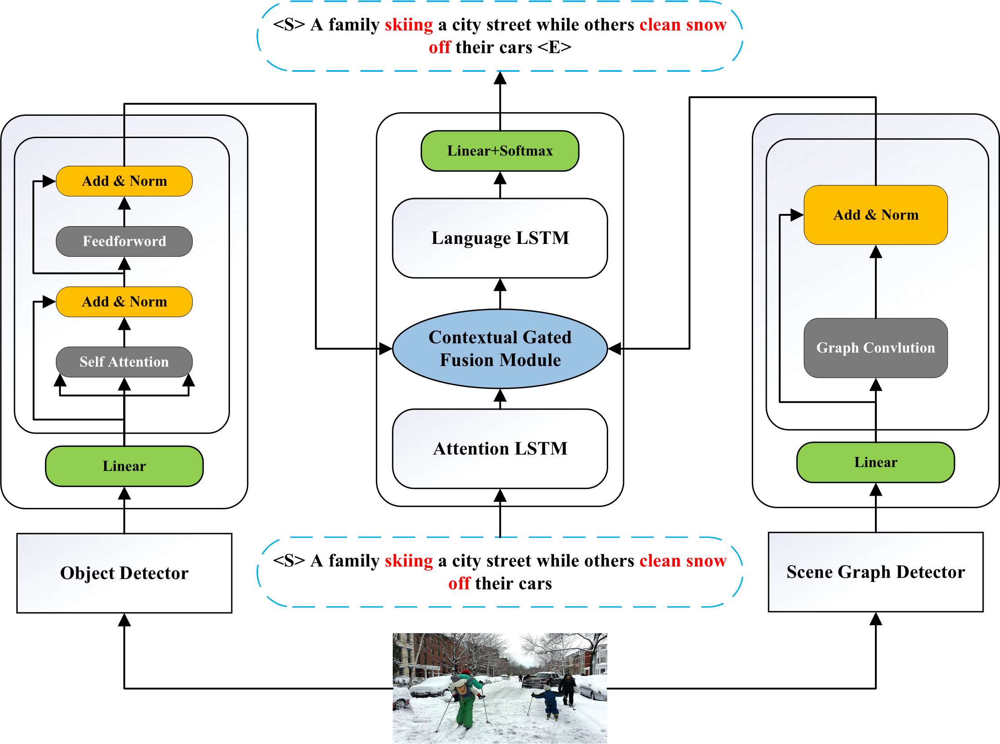

# DRAN

This repository includes the Pytorch code for our paper "Exploring Implicit and Explicit Relations with
the Dual Relation-Aware Network for Image Captioning" in MMM 2022.



## Dependencies
* Python 3+
* Pytorch 1.3.0+

Python and Pytorch can be installed by anaconda, run
```
conda create --name ENV_NAME python=3
source activate ENV_NAME
conda install pytorch torchvision cudatoolkit=10.1 -c pytorch
```
where `ENV_NAME` and [cudatoolkit version](https://pytorch.org/) can be specified by your own.

For the other dependencies, run `pip install -r requirements.txt` to install.

## Data

Please refer to [Sub-GC](https://github.com/YiwuZhong/Sub-GC). We only use COCO related datasets.

## Model Training

To train our image captioning models, run the script
```
bash train.sh DRAN
```


You can set `CUDA_VISIBLE_DEVICES` in `train.sh` to specify which GPUs are used for model training (e.g., the default script uses 2 GPUs).

## Model Evaluation and Caption Generation

To generate captions, run the script
```
bash test.sh DRAN
```

The inference results will be saved in a `captions_*.npy` file at the same folder as the model checkpoint (e.g., `pretrained/DRAN`). `$CAPTION_FILE` will be used as the name of generated `captions_*.npy` file in the following instructions.


## Acknowledgement

This repository was built based on [YiwuZhong's implementation](https://github.com/YiwuZhong/Sub-GC) for image captioning and partial evaluation protocols were implemented based on: [coco-caption](https://github.com/tylin/coco-caption)

